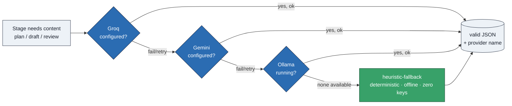

# Autonomous Document Agent — Flow Diagram

## End-to-end pipeline (`POST /agent`)

```mermaid
flowchart TD
    A([Client: POST /agent<br/>request: plain-English sentence]) --> B{0 · VALIDATE<br/>guardrails}
    B -- empty / too short / too long / unsafe --> BX[/HTTP 422<br/>AgentValidationError/]
    B -- ok --> C[1 · PLAN<br/>Planner<br/>type · title · audience · tone<br/>sections + self-generated TODO list]
    C --> D[2 · EXECUTE<br/>Executor drafts every section<br/>paragraphs · bullets · tables]
    D --> E[3 · REFLECT<br/>Reflector self-check<br/>score 0–100 · issues · weak sections]
    E --> F{passed?<br/>or revisions used?}
    F -- no · weak sections · revisions < 1 --> G[3b · REVISE<br/>rewrite weak sections] --> E
    F -- yes / budget spent --> H[4 · RENDER<br/>build_docx → styled .docx]
    H --> I[5 · RESPOND<br/>save file · index by id<br/>return download_url + plan<br/>+ reflection + trace]
    I --> J([Client downloads<br/>GET /documents/&#123;id&#125;])

    classDef stage fill:#2b6cb2,stroke:#1f2a44,color:#fff;
    classDef gate fill:#f6ad55,stroke:#7b341e,color:#1a202c;
    classDef err fill:#e53e3e,stroke:#742a2a,color:#fff;
    classDef io fill:#edf2f7,stroke:#2d3748,color:#1a202c;
    class C,D,E,G,H,I stage;
    class B,F gate;
    class BX err;
    class A,J io;
```

## How each stage gets its content — LLM provider fallback chain

Every generative stage (PLAN / EXECUTE / REFLECT) calls `LLMClient`, which walks
providers in priority order and always degrades to a deterministic offline engine.

