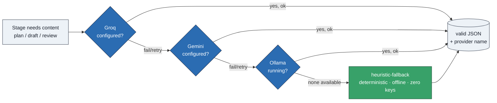

# Autonomous Document Agent
### Project Overview — Purpose & End-to-End Flow

---

## 1. Purpose

The **Autonomous Document Agent** is a document-writing agent exposed as a web API. You give it one plain-English sentence — for example, *"write a business proposal for an AI-powered customer-support chatbot"* — and it autonomously **plans, drafts, self-reviews, revises, and renders a finished Microsoft Word (`.docx`) document**. There are no templates to fill in and no back-and-forth.

The word "agent" is literal: it does not merely call a language model once. It gives itself a to-do list, works through it, critiques its own output, and improves it before returning the result — mirroring how a human writer works: **think → write → proofread → fix → deliver**.

---

## 2. End-to-End Flow

When a request is sent to the `POST /agent` endpoint, the `AgentOrchestrator.run()` control loop executes six stages in order:

```
your request
     │
 0. VALIDATE   guardrails: not empty, length limits, content-policy check   (orchestrator.validate)
     │
 1. PLAN       document type, title, audience, tone, section list,          (agent/planner.py)
     │          and a self-generated task / TODO list
     │
 2. EXECUTE    draft content for every section (paragraphs, bullets, tables)(agent/executor.py)
     │
 3. REFLECT    score the draft 0–100, list issues, flag weak sections       (agent/reflector.py)
     │
 3b. REVISE    if it didn't pass, rewrite weak sections & re-score          (bounded: max 1 pass)
     │
 4. RENDER     build_docx() → styled .docx file                            (document/builder.py)
     │
 5. RESPOND    save file, return download_url + plan + reflection + trace   (app/main.py)
```

| Stage | What happens |
|-------|--------------|
| **0 — Validate** | Guardrails: request must not be empty, must respect length limits, and must pass a basic content-safety check. |
| **1 — Plan** | The Planner decides document type, title, audience, tone, the list of sections, and generates its own task/TODO list. |
| **2 — Execute** | The Executor drafts the actual content for every section — paragraphs, bullet lists, and tables. |
| **3 — Reflect** | The Reflector scores the draft 0–100, lists issues, and flags which sections are weak (self-check). |
| **3b — Revise** | If the draft doesn't pass, the Executor rewrites weak sections and it's re-scored. Bounded to **1** pass to keep latency/cost predictable. |
| **4 — Render** | `build_docx()` converts approved content into a styled Word `.docx`. |
| **5 — Respond** | The file is saved; the API returns a download URL plus the plan, reflection, and full execution trace. |

Every step is recorded in a **`trace`** array in the response, so the entire run is observable end-to-end.

### Flow diagram

```mermaid
flowchart TD
    A([Client: POST /agent<br/>request: plain-English sentence]) --> B{0 · VALIDATE<br/>guardrails}
    B -- empty / too short / too long / unsafe --> BX[/HTTP 422<br/>AgentValidationError/]
    B -- ok --> C[1 · PLAN<br/>Planner<br/>type · title · audience · tone<br/>sections + self-generated TODO list]
    C --> D[2 · EXECUTE<br/>Executor drafts every section<br/>paragraphs · bullets · tables]
    D --> E[3 · REFLECT<br/>Reflector self-check<br/>score 0–100 · issues · weak sections]
    E --> F{passed?<br/>or revisions used?}
    F -- no · weak sections · revisions < 1 --> G[3b · REVISE<br/>rewrite weak sections] --> E
    F -- yes / budget spent --> H[4 · RENDER<br/>build_docx → styled .docx]
    H --> I[5 · RESPOND<br/>save file · index by id<br/>return download_url + plan<br/>+ reflection + trace]
    I --> J([Client downloads<br/>GET /documents/&#123;id&#125;])

    classDef stage fill:#2b6cb2,stroke:#1f2a44,color:#fff;
    classDef gate fill:#f6ad55,stroke:#7b341e,color:#1a202c;
    classDef err fill:#e53e3e,stroke:#742a2a,color:#fff;
    classDef io fill:#edf2f7,stroke:#2d3748,color:#1a202c;
    class C,D,E,G,H,I stage;
    class B,F gate;
    class BX err;
    class A,J io;
```



---

## 3. Works With Zero API Keys

Each stage that needs generated content asks the **`LLMClient`**, which is an ordered fallback chain of providers:

> **Groq → Gemini → Ollama → heuristic-fallback (deterministic, offline)**

The client tries each configured provider in priority order, with retries and exponential backoff. If an API key is present, you get rich, AI-written prose. If **no keys** are configured, it falls back to a built-in deterministic engine that still produces a complete, valid document.

A language model is **never required** for the agent to finish — it simply makes the writing better. This is why the service returns a working document even before any credentials are set up (your current state: `llm_active: false`).

### Provider fallback diagram



---

## 4. API Input Contract

The `POST /agent` endpoint accepts a small JSON body:

| Field | Type | Required | Meaning |
|-------|------|----------|---------|
| `request` | string | ✅ Yes | Natural-language description of the document to produce. |
| `include_base64` | boolean | ❌ No (default `false`) | If `true`, also return the `.docx` inline as base64. |

**Example request body:**
```json
{ "request": "Write a project status report for the Q3 launch of a mobile banking app." }
```

---

## 5. How to Test (Interactive Dashboard)

The service ships with FastAPI's built-in **Swagger UI** — an interactive dashboard for testing every endpoint from the browser. No separate frontend needed.

### Step 0 — Make sure the server is running
```powershell
Invoke-RestMethod http://127.0.0.1:8000/health
```
Expect `status: ok`. If it fails, start it from the project folder:
```powershell
python -m uvicorn app.main:app --host 127.0.0.1 --port 8000
```

### Step 1 — Open the dashboard
Browse to **http://127.0.0.1:8000/docs**

You'll see three endpoints:

| Endpoint | Purpose |
|----------|---------|
| `POST /agent` | Generate a document from a natural-language request |
| `GET /documents/{doc_id}` | Download a previously generated `.docx` |
| `GET /health` | Liveness + which LLM providers are active |

### Step 2 — Generate a document
1. Click **`POST /agent`** to expand it.
2. Click **`Try it out`**.
3. Edit the pre-filled request body, e.g.:
   ```json
   {
     "request": "Write a business proposal for a solar panel installation company.",
     "include_base64": false
   }
   ```
4. Click **`Execute`**.
5. In **Server response**, confirm **Code `200`** and read the **Response body** — it contains `title`, `document_type`, `quality_score`, a `trace`, and a `document.download_url`.

### Step 3 — Download the result
Copy the `download_url` (e.g. `http://127.0.0.1:8000/documents/abc123…`) and either:
- paste it into a new browser tab to download the `.docx`, **or**
- expand **`GET /documents/{doc_id}`** → **Try it out** → paste just the `doc_id` → **Execute** → **Download file**.

> Tip: set `"include_base64": true` to also get the whole `.docx` embedded as text in the JSON response — useful to verify content without downloading.

### What success looks like
- `/health` → `status: ok`
- `/agent` → green `200`, `word_count > 0`, `quality_score` (usually `100` on the offline engine), a valid `download_url`
- The downloaded `.docx` opens in Word with headings, paragraphs, and sections.

> A read-only alternative view is available at **http://127.0.0.1:8000/redoc** (no "Try it out" — use `/docs` for actual testing).

---

## 6. In One Line

> Turn a one-sentence request into a polished Word document, fully autonomously — **plan, draft, self-check, revise, render** — with graceful degradation from real LLMs down to an offline engine, so the service always returns something usable.
